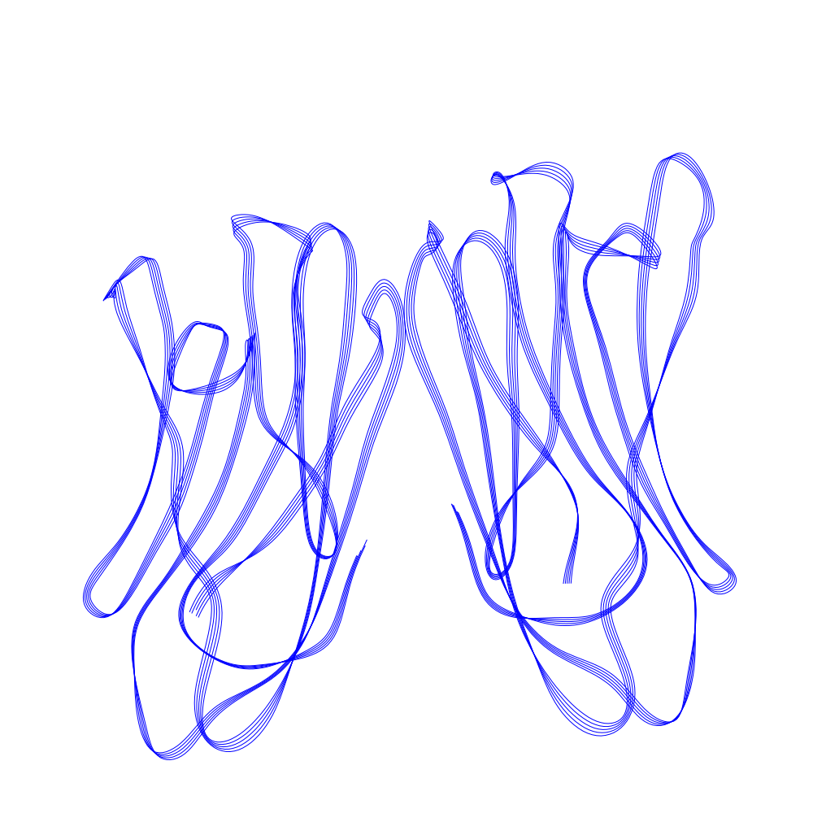
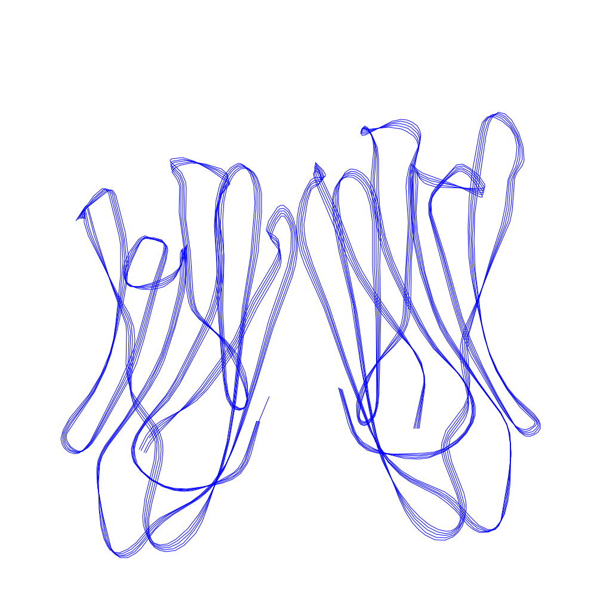
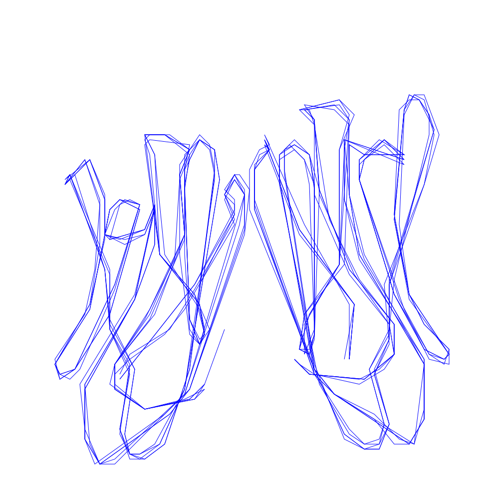

# Simplify SVG for usesage in machine learning

Simple library to simplify SVGs for machine learning. The simpler SVGs are constist of polylines with discrete points.

## Installation

```bash
pip install -q git+https://github.com/piebro/svgsimplify
```

## Usage

Save all SVGs you want do simplify in a directory. The SVGs need to have `viewBox="0 0 1000 1000"`, `width="26.45834cm"` and `height="26.45834cm"`. `linesimplify` sets how much the lines are simplified to polylines with less lines and `round_decimals` sets how much each point is rounded.

```python
import svgsimplify
# simplify SVG
svgsimplify.simplify(load_svg_path, save_svg_path, linesimplify=0.1, round_decimals=1)
# simplify dir with SVGs
svgsimplify.simplify_dir(load_dir, save_dir, linesimplify=0.1, round_decimals=1)
```

Save a pickeled Python list of polylines of all SVGs in the taget dir.

```python
svgsimplify.save_simplified_svg_dir_with_pickle(save_dir, "dataset.pkl")
```

## Example

Original SVG with 304KB:


`linesimplify=0.1` and `round_decimals=1` with 84KB:



`linesimplify=1` and `round_decimals=0` with 28KB:



`linesimplify=10` and `round_decimals=-1` with 8KB:




