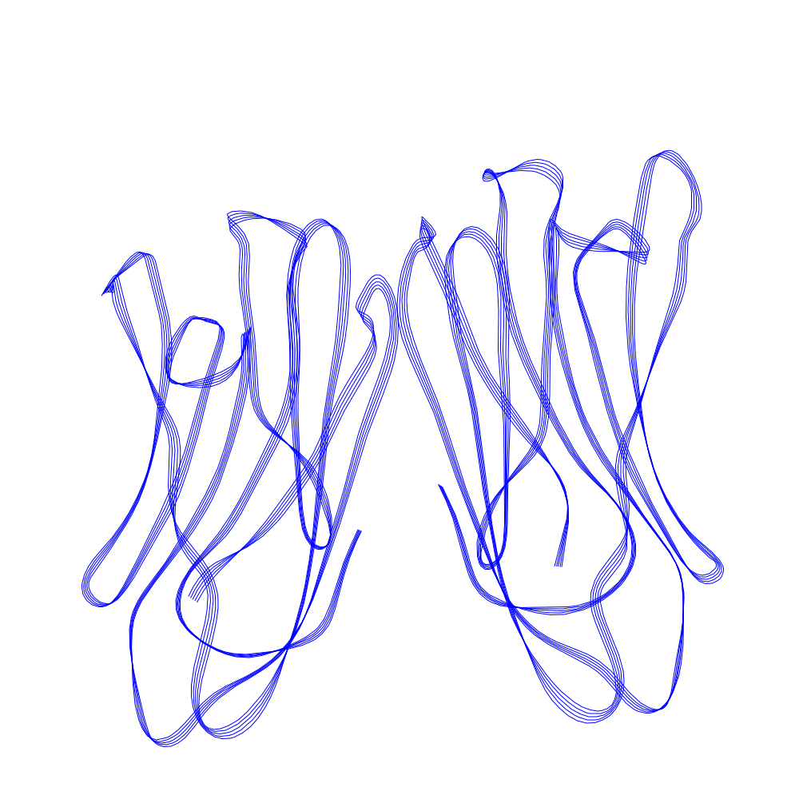
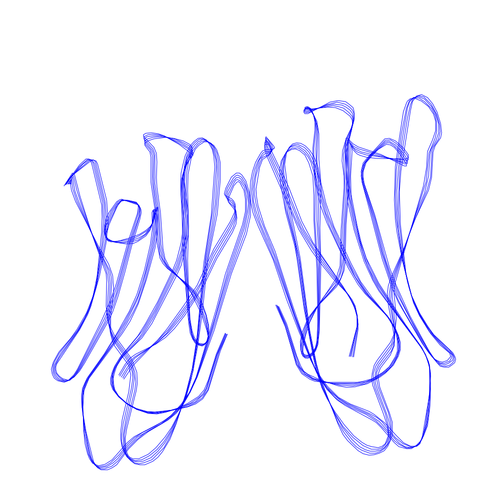
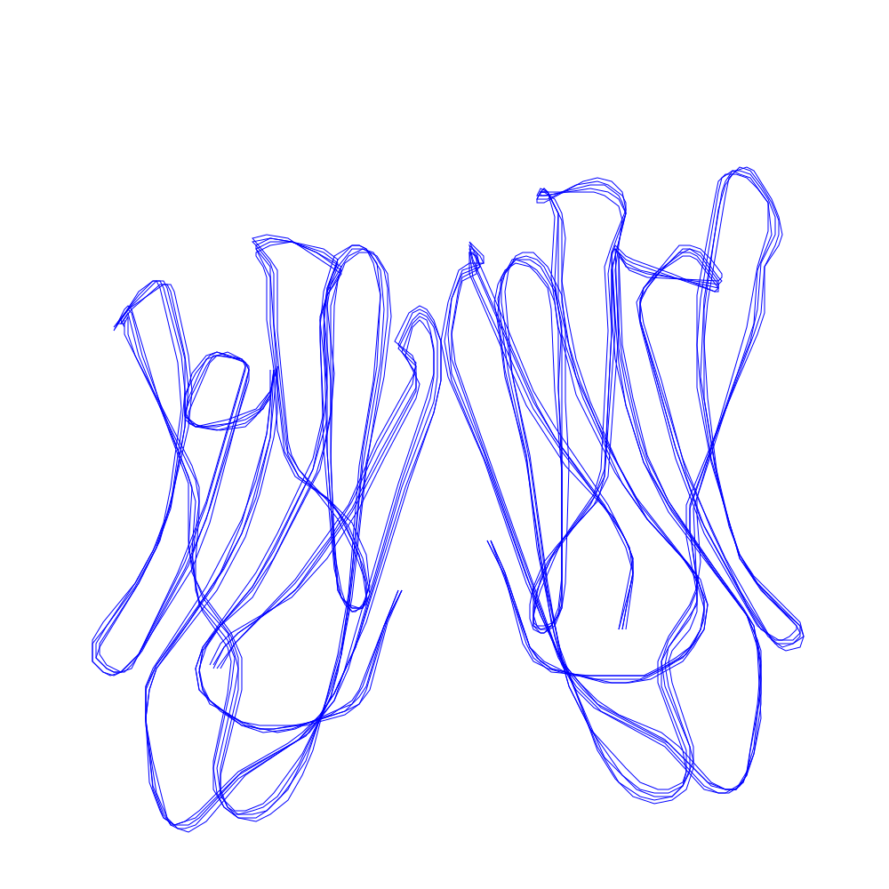

# Library for usage of SVGs in machine learning

Library to simplify SVGs for machine learning. The simpler SVGs are constist of polylines with discrete points.

## Installation

```bash
pip install -q git+https://github.com/piebro/svg_data_util
```

## Usage


### Simpify SVG

```python
from svg_data_util import svg_to_lines, simplify_lines, save_svg, get_svg_from_lines

# the points of the lines should be in [0 0 1000 1000]
lines = svg_to_lines("examples/1BKZ.svg")
sim_lines = simplify_lines(lines, max_xy=1000, rdp_epsilon=1) # rdp_epsilon describes how much the lines are simplified
save_svg("examples/1BKZ_1000_1.svg", get_svg_from_lines(sim_lines, background=None))
```

### Create simplified SVG dataset

```python
from svg_data_util import svg_dir_to_dataset_pkl, save_simplified_dataset_pkl, dataset_pkl_to_lines

svg_dir_to_dataset_pkl("examples", "examples.pkl")
save_simplified_dataset_pkl("examples.pkl", "examples.pkl_2_500_1.pkl", svg_count_in_new_dataset=2, max_xy=500, rdp_epsilon=1)
svg_lines = dataset_pkl_to_lines("examples.pkl_2_500_1.pkl")
```

## Example

Original SVG with 224K:


`max_xy=10000` and `rdp_epsilon=0.5` with 40KB:



`max_xy=1000` and `rdp_epsilon=1` with 28KB:



`max_xy=250` and `rdp_epsilon=2` with 20KB:




